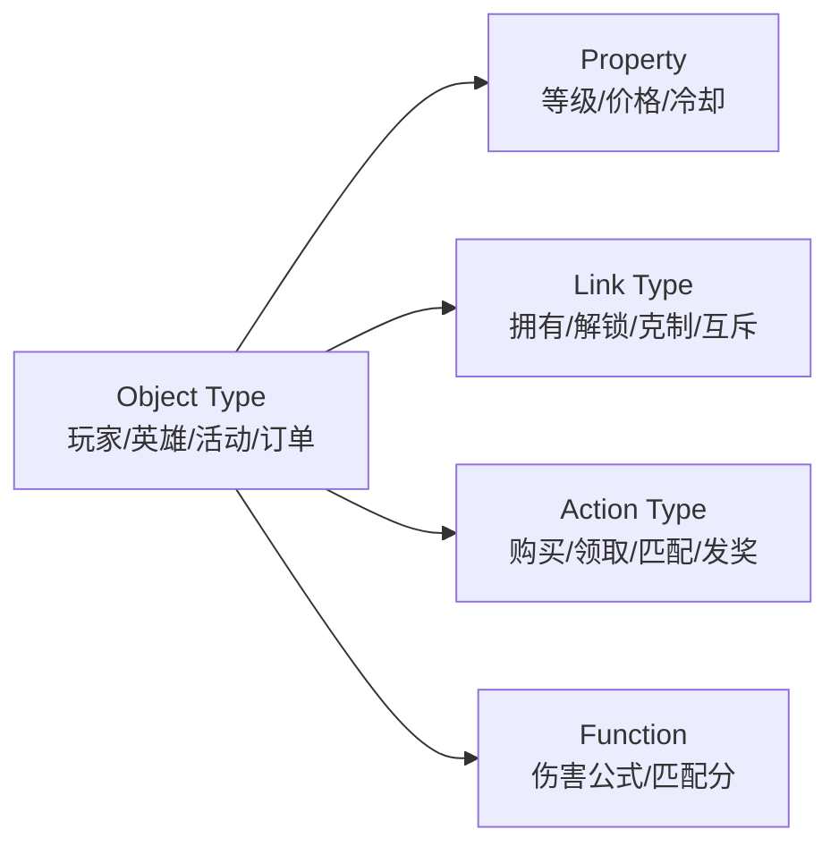

> 本文基于葡萄城技术团队《从领域驱动到本体论：AI 时代的架构方法论变了》的解读，结合我们游戏研发 AI 协作平台的实践，给出**可落地**的手游视角架构方案。

## 0. 一句话先说清

**本体论（Ontology）** 不是哲学课里的「存在论」。在软件工程里，它指的是：把**游戏/业务世界里的东西（对象）、关系、能做什么（操作）、不能做什么（约束）**，建成一套**机器和人都能查、能执行、能审计**的语义模型，并把它放在**平台层**而不是散落在代码里。

AI 要进核心玩法与运营决策，缺的就是这层「世界说明书」。

---

## 1. 问题从哪来：AI 能读表，却读不懂「能不能发这批货」

在传统的汽配订单场景里：库存 120、订单 100，模型说可发货。但业务知道有预留、信用审核、渠道审批——**规则不在字段里，在关系与流程里**。

手游里同类场景极多：

| 表面数据 | AI/新人容易下的结论 | 业务真实约束（常藏在代码/表/人脑） |
|----------|---------------------|-------------------------------------|
| 玩家金币足够 | 可以购买礼包 | 该礼包仅限首充用户、且与另一活动互斥 |
| 活动配置已上线 | 可以全服推送 | 仅渠道 A、且需灰度 5% 再全量 |
| 副本掉落表有道具 X | 可以调高掉率 | 经济系统有全局通胀护栏，与商城定价联动 |
| 战斗服内存够 | 可以开新房间 | 同大区帧同步房间有上限与匹配规则 |

这与知识库中 **上下文工程** 的共识一致：大模型擅长生成与检索，但**边界清晰的约束**必须外置为可验证结构，否则 Agent 只能在「工具层」打转，进不了「对结果负责」的决策层。

---

## 2. DDD 指了路，为什么手游团队仍觉得「用不动」

领域驱动设计（DDD）的核心仍然正确：

- **统一语言**：策划说的「赛季」「通行证」「保底」与程序、数据、运营同一套词；
- **限界上下文**：战斗、经济、社交、LiveOps 活动不要揉成一个巨型模型；
- **战术模式**：实体、值对象、聚合、领域事件。

但在手游交付节奏下，DDD 常死于：

1. **规则最终仍进代码**：例如「十连保底」写在 `GachaService` 的 `if`、Excel 导表脚本、客户端预判逻辑三处；
2. **统一语言难维护**：版本冲刺后策划文档、配置表字段、代码枚举三套命名；
3. **为 DDD 而 DDD**：简单 UI 弹窗也强行上聚合根，团队抵触。

博文结论可概括为：**不是 DDD 错了，是没有「把模型钉在平台上」的工程载体。** 本体论方法论 + 元数据驱动平台，是把 DDD 的「约定」升级成「基础设施」。

---

## 3. 本体论是什么：用「游戏策划表」的升级版来理解

Palantir Foundry 的 Ontology 可类比为**全公司（全项目）共享的、带行为约束的「超级配置 + 对象图谱」**。

### 3.1 五类核心构件（白话）

| 构件 | 手游例子 | 和纯配置表的区别 |
|------|----------|------------------|
| **Object Type** | `Player`、`Hero`、`BattlePassSeason` | 类型自带语义与生命周期，不是匿名行 |
| **Property** | 英雄星级、活动开始时间 | 带类型、校验、展示元数据 |
| **Link Type** | `Player`—owns→`Hero`；`Activity`—mutexWith→`Activity` | 关系是一等公民，可查询、可约束 |
| **Action Type** | `ClaimDailyReward`、`PurchaseOffer` | **定义允许的状态迁移 + 前置条件 + 副作用** |
| **Function** | 战力计算、匹配 Elo | 逻辑挂在对象世界上，而非散落工具类 |

### 3.2 和 DDD 的分水岭

- **DDD**：聚合边界、不变式靠团队在**代码评审**里守住；
- **Ontology**：不变式写在 **Action Type 的约束**里，平台在执行前校验，AI/自动化/API **同一套闸门**。

### 3.3 被低估的能力：决策捕获（Decision Capture）

不仅记录「规则是什么」，还记录「谁在什么情况下做了什么决定」：

- 运营把某服活动奖励从 A 调成 B；
- 策划批准例外发货；
- 主策否决某次数值实验全量。

写回本体层后，下次 AI 辅助决策能学到**组织真实决策史**，而不是只读静态表。

---

## 4. 对 AI 的两档能力：工具层 vs 决策层

博文给出清晰分界：

| | 无 Ontology | 有 Ontology |
|---|-------------|-------------|
| **代码 Agent** | 补全、重构、单测 | 仍可做，但改的是「执行层」 |
| **业务 Agent** | 生成 SQL/脚本，可能违反经济规则 | 只能在 `Action Type` 允许范围内提议或执行 |
| **运营 Agent** | 读报表讲故事 | 基于对象关系做「若全服发 X，影响哪些库存与活动」 |
| **责任边界** | 无法对业务结果负责 | 操作可审计、可回滚、可复现 |

这与**游戏研发 AI 协作平台**中「双模运行」（人读 `.cursorrules` / Agent Server 读同一规则）方向一致：规则必须**单源、可读、可执行**；本体论进一步要求规则**单源在语义平台**，而非仅在自然语言规则文件里。

---

## 5. 手游行业：如何用本体论「更有创意、更有效率」

以下不假设你们已采购商业平台；重点是**方法论可渐进落地**。

### 5.1 创意：从「改代码」到「改世界」

创意常被误解为「想新点子」。在成熟手游团队，创意更多表现为**在约束内重组玩法与经济**：

1. **统一对象世界供策划与 AI 共思**  
   建立 `Hero`、`Skill`、`Buff`、`Stage`、`DropTable` 的 Link（克制、标签、赛季归属）。策划用自然语言描述「火系英雄对冰系 Boss 伤害 +20%」，AI 辅助时查询的是**图关系**，而不是全文搜索某个 `if`。

2. **活动模板 = Action Type 组合**  
   七日登录、Battle Pass、限时礼包不是每次从零写逻辑，而是复用 `ClaimReward`、`ProgressMilestone`、`PurchaseOffer` 等**已定义操作**，创意体现在**新对象实例与关系**，而非新分支代码。

3. **What-if 沙盒**  
   在 Ontology 层做「若全服发放道具 X」：沿 Link 追踪库存、通胀指标、互斥活动——比让 AI 直接改表安全一个数量级，**更愿意做大胆尝试**。

### 5.2 效率：规模经济落在 LiveOps 与研发管线

本体论补的是**业务语义层**：

| 痛点 | 仅编排/Agent | + 本体论 |
|----------------------|-----------------|----------|
| 商业化活动每周一版 | DAG 生成代码快 | 活动对象、奖励、互斥关系复用，少造数据管道 |
| 配置表字段爆炸 | Agent 读 Excel | Agent 读**类型化对象 + Action**，少幻觉列名 |
| 多角色上下文割裂 | 飞书 + Git 规则 | 策划/程序/运营同一 **Object 词汇表** |
| AI 改经济逻辑有风险 | 人工 CR | **Action Type 前置校验**，自动挡违规改动 |

**渐进路径（建议顺序）**：

1. **词汇表与对象清单（2–4 周）**  
   从当前最赚钱的一条管线（如「商业化活动」）列出 Object / Link / Action 白名单，对齐策划文档用语。

2. **把「写操作」收成 Action Type（1–2 个版本）**  
   发奖、扣费、改活动状态、灰度开关——凡 AI 或自动化可能触达的，必须有显式前置条件与副作用声明。

3. **决策日志写回**  
   运营调参、紧急补偿、例外审批进 Decision 存储，供下一版活动 Agent 检索。

### 5.3 手游典型 Ontology 切片（示例）

**核心 Object Types**

- `Player`、`Account`、`ServerShard`
- `Hero`、`Equipment`、`InventoryItem`
- `Quest`、`BattlePassSeason`、`CommercialActivity`

**典型 Link Types**

- `Player` —owns→ `Hero`
- `Activity` —grants→ `RewardBundle`
- `Activity` —mutexWith→ `Activity`

**典型 Action Types（须带约束）**

- `PurchaseOffer`：余额、限购、互斥、渠道、版本号
- `ClaimActivityReward`：活动时间、完成度、是否已领
- `StartPvPMatch`：段位、封禁、服务器负载

---

## 6. 风险与务实建议

| 风险 | 缓解 |
|------|------|
| 大而全建模瘫痪 | 从一条管线（商业化活动 / 战斗匹配）做垂直切片 |
| 与现有 Excel 工作流冲突 | Ontology 层可由导表工具生成，不要求策划直接画本体 |
| 团队以为「买个平台就行」 | 本体是**组织共识**，平台只是载体；无统一语言仍会空心化 |
| 和 DDD 名词打架 | 对内可说「显式领域模型 + 可执行约束」；Ontology 对外对齐供应商/行业用语 |

---

## 7. 结论

- **问题本质**：AI 进不了核心业务，因为业务语义在代码、流程、人脑里，**不可查询、不可执行前校验**。
- **DDD**：方向对，缺平台化支撑；手游节奏下更易退化。
- **本体论**：把对象、关系、操作、约束升为**平台元数据**，并记录决策，形成闭环。
- **对手游**：创意来自**在安全沙盒里重组对象与 Action**；效率来自**LiveOps 与研发复用同一语义层**。

**架构师在 AI 时代的上移**，不是少写代码，而是**先把游戏世界建模清楚**——让策划、程序、运营与 Agent 在同一套「世界说明书」上协作。
